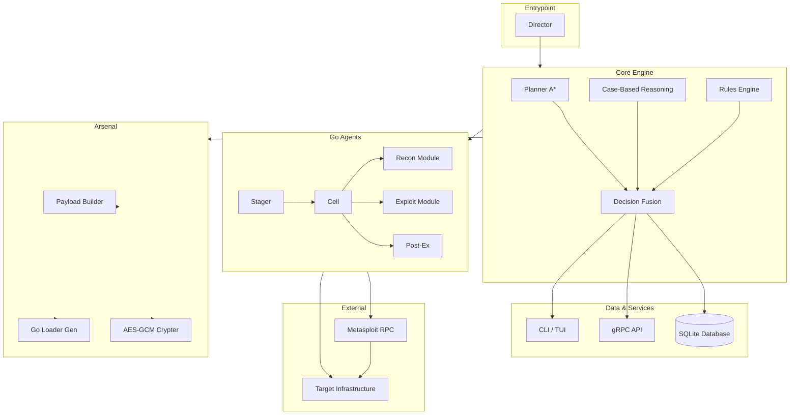

<div align="center">
  <a href="https://capsule-render.vercel.app/api?type=waving&color=gradient&height=200&section=header&text=Titan-Operations&fontSize=60&fontAlignY=35&animation=fadeIn&fontColor=ffffff">
    
  </a>
</div>

<p align="center">
  <a href="https://readme-typing-svg.herokuapp.com?font=Fira+Code&weight=600&size=22&pause=1000&color=00F7FF&center=true&vCenter=true&width=800&lines=ARGOS+v2.0;Semi-Autonomous+Offensive+Operations+Platform;APT+Emulation+%26+Hybrid+Decision+Engine;Human-in-the-Loop+%26+NetworkX+Knowledge+Tree">
    
  </a>
</p>

<p align="center">
  
  
  
  
  
  
  
  
</p>

---

# Titan-Operations — ARGOS v2.0

**Semi-Autonomous Offensive Operations Platform** designed for **APT emulation**, **Red Team engagements**, and **adversary simulation**. Built on a **Hybrid Decision Engine** (A* Planner + Case-Based Reasoning + Tactical Rules) with a **Human-in-the-Loop** oversight model and a **NetworkX Knowledge Tree** that maintains real-time battlefield awareness.

> Formerly known as **ArgusPest** · Now evolved into **Titan-Operations**.

---

## Architecture



---

## Quick Start

```bash
git clone https://github.com/Ruby570bocadito/Titan-Operations.git
cd Titan-Operations
python -m venv .venv && source .venv/bin/activate
pip install -e ".[dev]"
python argos_console.py
```

---

## Interactive Console

Once inside the console, use the following commands:

| Command | Description |
|---------|-------------|
| `guide` | Architecture overview and workflow |
| `start [t] [g] [p]` | Launch a mission (target, goal, profile) |
| `start --auto` | Start with auto-approval mode |
| `demo [--fast]` | 6-phase narrated demonstration |
| `status` | Mission state and phase details |
| `agent register <name> <ip>` | Register a new agent |
| `agent list` | List all registered agents |
| `agent find <query>` | Locate an agent by metadata |
| `decide list` | View pending decisions |
| `decide approve <id>` | Approve action (HITL) |
| `decide reject <id>` | Reject action (HITL) |
| `lab` | Deploy vulnerable lab (6 targets) |
| `test unit` | Run 34 unit tests |
| `quit` | Exit the console |

You can also use the traditional CLI:

```bash
python ui/cli.py start -t 10.0.0.0/24 -g domain_admin -p balanced
python ui/cli.py dashboard            # Full TUI dashboard
python ui/cli.py arsenal build stager --os linux --arch amd64
```

---

## Console Commands (Detailed)

```
argos> guide               Architecture and flow of ARGOS
argos> start [t] [g] [p]   Start mission (default: 10.100.0.0/24 domain_admin balanced)
argos> start --auto        Start with auto-approval
argos> demo [--fast]       6-phase narrated demo
argos> status              Detailed mission status
argos> agent register ...  Register agent
argos> agent list          List agents
argos> agent find ...      Find agent
argos> decide list         Pending decisions
argos> decide approve <id> Approve (HITL)
argos> decide reject <id>  Reject (HITL)
argos> lab                 Laboratory (6 targets)
argos> test unit           34 tests
argos> quit                Exit
```

---

## Project Structure

```
├── main.py              # Director entrypoint
├── config.yaml           # Global configuration
├── pyproject.toml        # Dependencies & tooling
├── core/                 # Decision engine
│   ├── director.py       # Mission orchestrator
│   ├── event_bus.py      # Async pub/sub
│   ├── knowledge_tree.py # Live World Graph (NetworkX)
│   ├── planner.py        # A* attack path planner
│   ├── cbr.py            # Case-Based Reasoner (Qdrant + embeddings)
│   ├── rules_engine.py   # Tactical rules (~500 lines, 10+ services)
│   ├── decision_fusion.py# Weighted fusion of 3 engines
│   ├── recon_manager.py  # Auto-recon dispatch
│   ├── exploit_manager.py# Exploit dispatch (agent / MSF)
│   └── msf_rpc.py        # Metasploit RPC integration
├── database/             # SQLAlchemy models (SQLite WAL)
├── api/                  # gRPC server (protobuf)
├── ui/                   # CLI (Click + Rich) & TUI (Textual)
├── arsenal/              # Malware factory
│   ├── builder.py        # Go/Rust compiler + obfuscation
│   └── crypter.py        # AES-GCM payload crypter + Go loader gen
├── evasion/              # Traffic camouflage (Chameleon C2)
├── ctf/                  # Flag hunter + auto-submitter
├── agents/               # Go field agents
│   ├── stager/           # Initial access payload
│   ├── cell/             # Full persistent agent
│       ├── recon/        # Port scanner + SMB enum
│       ├── exploit/      # Shellcode injection (syscalls)
│       └── post/         # Credential dump + persistence
│   └── python_cell/      # Python test agent
├── tests/                # Test suite
│   ├── test_director.py  # 36 unit tests (core engine)
│   ├── mock_agent.py     # Event bus simulation
│   ├── demo_integration.py # End-to-end demo
│   └── docker-compose-lab.yml # Vulnerable lab (6 targets)
└── shared/proto/         # Protobuf schema
```

---

## Decision Engine

The Director evaluates the battlefield via a **Live World Graph** (NetworkX MultiDiGraph). Each agent discovery (host, service, credential, flag) updates the graph. The next move is determined by:

| Engine | Weight | How |
|--------|--------|-----|
| **A* Planner** | 45% | Finds silent/fast routes through exploit edges to the goal |
| **CBR Memory** | 30% | Vector similarity search (Qdrant + SentenceTransformers) — what worked before? |
| **Rules Engine** | 25% | Deterministic rules for known services (SSH → brute, SMB 445 + Win7 → EternalBlue, etc.) |

The **Global Defense State (GDS)** tracks enemy network paranoia (0.0–1.0). At 0.90, the **Kill Switch** triggers — all agents hibernate.

---

## Go Agents

```bash
# Compile stager (initial access)
make build-stager          # plain: agents/stager/stager.exe
make build-stager-obf      # garbled-obfuscated

# Compile cell (full agent)
make build-cell            # agents/cell/cell.exe

# Cross-compile for Linux
make build-stager-linux
```

---

## Docker Lab

```bash
docker-compose -f tests/docker-compose-lab.yml up -d
```

Launches on `10.100.0.0/24`:

| IP | Service |
|----|---------|
| `10.100.0.20` | Apache 2.4.49 (CVE-2021-41773) |
| `10.100.0.21` | SSH weak credentials (admin:admin123) |
| `10.100.0.22` | MySQL 5.7 no auth |
| `10.100.0.23` | vsftpd 2.3.4 backdoor (CVE-2011-2523) |
| `10.100.0.24` | Redis no auth |
| `10.100.0.30` | DVWA web app |

```bash
docker-compose -f tests/docker-compose-lab.yml down
```

---

## Testing

```bash
# Full suite (34 pass, 2 skip for ML deps)
pytest tests/ -v --tb=short

# Fast — skip CBR/ML tests
pytest tests/ -v --tb=short -k "not cbr"

# Integration demo
python tests/demo_integration.py
```

---

## Dependencies

| Category | Libraries |
|----------|-----------|
| Core | networkx, pyyaml, grpcio, protobuf |
| Decision | qdrant-client, sentence-transformers, torch (optional) |
| API | fastapi, uvicorn, websockets |
| DB | sqlalchemy, aiosqlite |
| CLI/TUI | click, rich, textual |
| Security | impacket, scapy, pymetasploit3 |
| Dev | pytest, pytest-asyncio, pytest-cov, black, ruff |

Full install: `pip install -e ".[all]"`

---

## Warning

> This tool is developed strictly for educational and authorized Red Team exercises.  
> Using it against infrastructure without prior written consent from its owners is illegal.

---

<p align="center">
  <a href="https://github.com/Ruby570bocadito/Titan-Operations">
    
  </a>
  <a href="https://www.python.org/">
    
  </a>
  <a href="https://go.dev/">
    
  </a>
  <a href="https://www.docker.com/">
    
  </a>
  <a href="https://metasploit.com/">
    
  </a>
  <br />
  <br />
  <strong>Built with ❤️ for the Red Team Community</strong>
  <br />
  <sub>© 2026 Ruby570bocadito · MIT License</sub>
</p>
